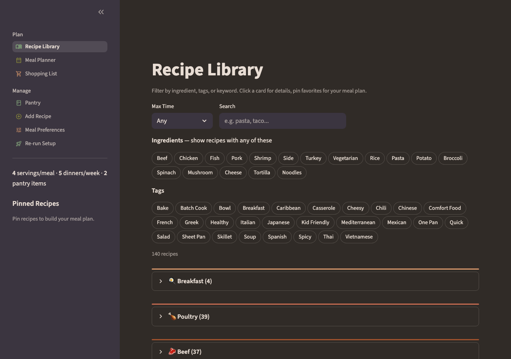
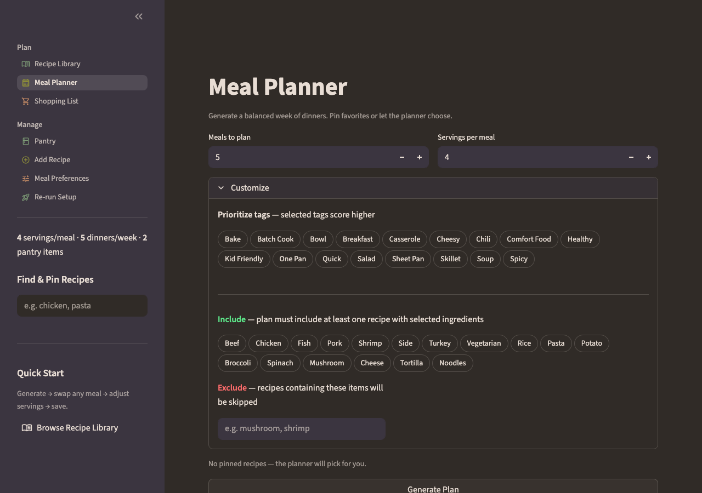
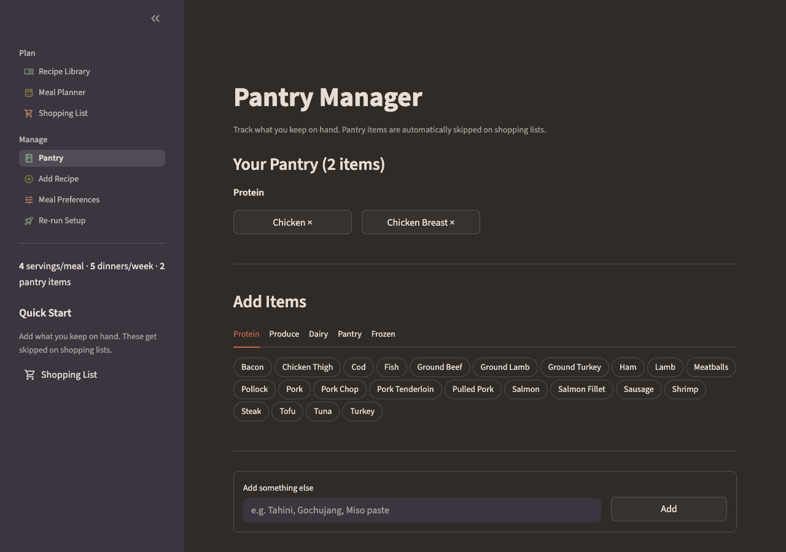
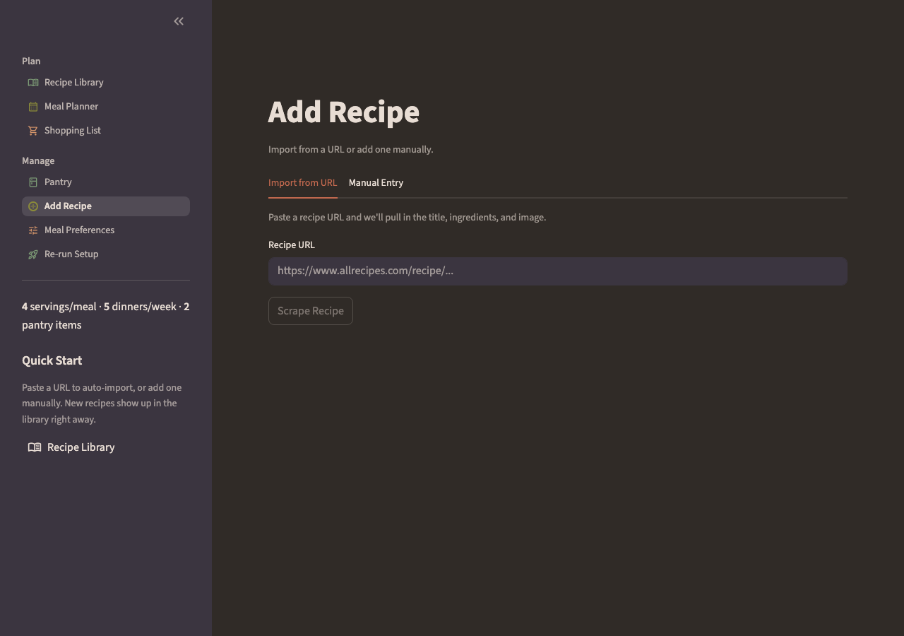

# Meal Planner

Weekly meal planning app built with Streamlit, SQLite, and Pandas. Generates dinner plans scored against pantry, builds grouped shopping lists, and handles recipe import from URLs with ingredient normalization.

**[Live Demo](https://meal-planner-bre2026.streamlit.app)**

## Screenshots

| Recipe Library | Meal Planner |
|:-:|:-:|
|  |  |

| Pantry | Add Recipe |
|:-:|:-:|
|  |  |

## Features

**Recipe Library** — 142 recipes, filterable by protein, cook time, and tags. Pin favorites to add to the weekly meal planner.

**Meal Planner** — Generates 2-7 day dinner plans. Scores recipes based on pantry matches, selected tags for cusine or cook time, then uses weighted random selection so you get a different plan each time. Enforces protein variety while prioritizing existing inventory (use up what we already have, but no chicken three nights in a row).

**Shopping List** — Pulls ingredients from your plan, scales quantities by servings, groups by store section, and filters out anything already in your pantry.

**Add Recipe** — Paste a URL and the scraper pulls in title, ingredients, and image. Or add one by hand.

## Ingredient normalization

Recipe sites format ingredients inconsistently — unicode fractions, embedded brand names, metric/imperial mixing, prep instructions stuffed into the name. The normalization scripts (`src/scraper.py`, `src/ingredients.py`) handle parsing and are included so the pipeline stays consistent as recipes are added.

`ingredients.py` maintains a section map (~200 ingredients → store sections) and an alias table for common variants.

## Tech

**Stack:** Streamlit, SQLite (7 tables), Pandas, recipe-scrapers, cloudscraper, TheMealDB API, Material Icons, custom CSS

**Dev tools:** pytest (146 tests), Ruff, Claude Code (Opus/Sonnet 4.6)

## Project structure

```text
app.py                  # Entry point, nav, onboarding
pages/
  0_setup.py            # First-run setup + pantry
  1_recipes.py          # Recipe library
  2_planner.py          # Plan generator
  3_shopping.py         # Shopping list
  4_pantry.py           # Pantry manager
  6_add_recipe.py       # URL import + manual entry
  7_preferences.py      # Settings + reset
src/
  database.py           # Schema + queries
  scraper.py            # URL scraping + ingredient parsing
  ingredients.py        # Normalization, aliases, sections
  planner.py            # Scoring + plan generation
  shopping.py           # List formatting
  models.py             # Dataclasses
  units.py              # Unit conversion
tests/                  # 146 tests
data/meals.db           # SQLite database
```

## Run locally

Only five dependencies: `streamlit`, `pandas`, `cloudscraper`, `recipe-scrapers`, `requests`.

```bash
git clone https://github.com/brittraee/meal-planner.git && cd meal-planner
python3 -m venv .venv && source .venv/bin/activate
pip install -e ".[dev]"
streamlit run app.py
```

## Built by

[Brittney Erler-Rajek](https://github.com/brittraee)

AI-Disclosure: Utilizing Claude Code (Opus 4.6) for planning, debugging, and documentation lookups.

## License

MIT
